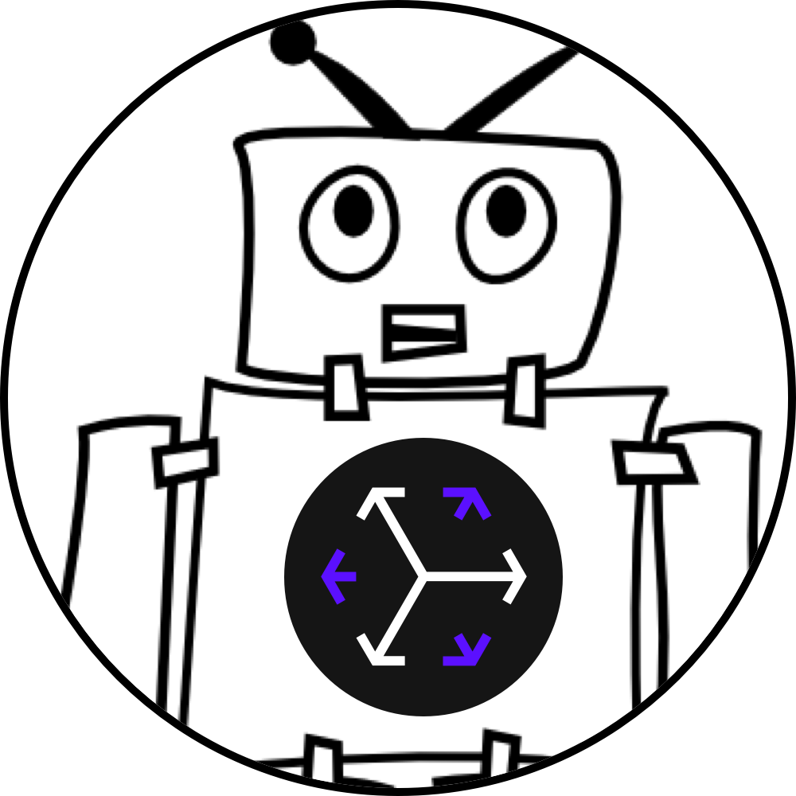
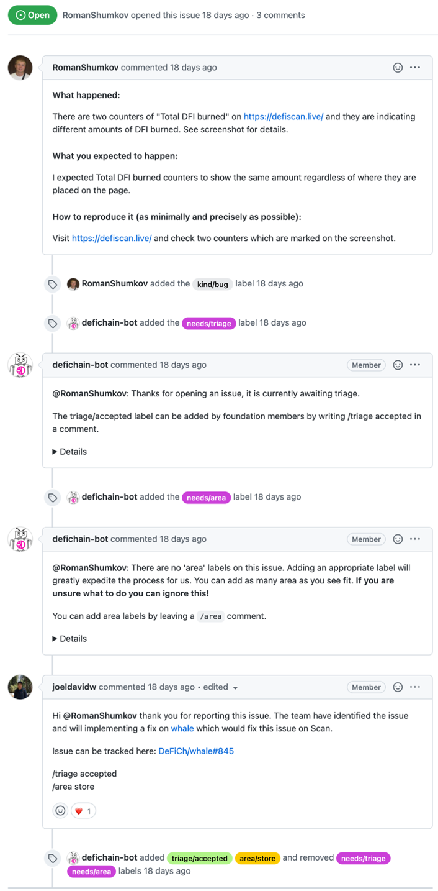

# OSS Governance

[](https://codecov.io/gh/DeFiCh/oss-governance)
[](https://www.codacy.com/gh/DeFiCh/oss-governance/dashboard)
[](https://github.com/DeFiCh/oss-governance/releases)
[](https://github.com/DeFiCh/oss-governance/blob/main/LICENSE)

<!-- 3 Arc: Context - Problem - Solution -->

In [DeFiChain](https://defichain.com/), our projects are open source, and our primary vision is to enable decentralized
finance with Bitcoin-grade security, strength and
immutability. [It's a blockchain dedicated to fast, intelligent and transparent financial services, accessible by everyone](https://defichain.com/white-paper/)
.

Although putting our project on GitHub makes it transparent and visible for public contributions, it's far from making
it maintainable. For new contributors, creating an issue or pull request and successfully sending it is a mountainous
journey in itself. Quality control hierarchy such as 'Triage', 'Conventional Commits', 'CI steps' and 'Code review'
often deter contributors from contributing due to the complex nature of each OSS governance policy.

A healthy open source projects must be able to scale to thousands of contributors. This project is an attempt to bring
efficacy to the process by lowering the barrier of entry for community participation. The onus should be on the
reviewers or ChatBot/ChatOp to guide the contributor through a series of education (governance/triage requirements) or
adjustment (code review changes).

This project is created to fully utilize the GitHub generous open source policy. It runs on GitHub Actions workflow
hooks and deeply integrate with many GitHub offerings. In addition to providing a chat-bot experience when contributor
interact with your project, `oss-governance` also provide automation in the form of policy enforcement. Community
contributors can trigger chat-ops via /slash style commands.

## What can OSS Governance do for you?

* Speed up issue triaging with automated chat-bot and chat-ops operations.
* Increased code review agility by moving quality control hierarchy from requirements to educational steps.
* Scale to thousands of contributors without alienating community participation with complex quality control hierarchy.
* A GitHub Action that lives natively and integrate well with the GitHub action/workflow product offering. You can view
  the source directly and modify it to your needs.



## Usage

#### `.github/workflow/governance.yml`

```yml
# .github/workflow/governance.yml

on:
  pull_request_target:
    types: [ synchronize, opened, labeled, unlabeled ]
  issues:
    types: [ opened, labeled, unlabeled ]
  issue_comment:
    types: [ created ]

jobs:
  governance:
    name: Governance
    runs-on: ubuntu-latest
    steps:
      # Semantic versioning, lock to different version: v1, v1.x or a commit hash.
      - uses: DeFiCh/oss-governance@v1
        with:
          # You can use a PAT to post a comment/label so that it shows up as a user instead of github-actions
          # Set the user to Triage, full repo scope.
          bot-token: ${{secrets.BOT_PAT}} # optional, default to '${{ github.token }}'
          github-token: ${{secrets.GITHUB_TOKEN}} # optional, default to '${{ github.token }}'
          config-path: .github/governance.yml # optional, default to '.github/governance.yml'
```

#### `.github/governance.yml`

```yml
# .github/governance.yml

version: v1

issue:
  labels:
    - prefix: triage
      list: [ "accepted" ]
      multiple: false
      author_association:
        collaborator: true
        member: true
        owner: true
      needs:
        comment: |
          @$AUTHOR: This issue is currently awaiting triage.

          The triage/accepted label can be added by org members by writing /triage accepted in a comment.

    - prefix: kind
      list: [ "feature", "bug", "question" ]
      multiple: false
      needs:
        comment: |
          @$AUTHOR: There are no 'kind' label on this PR. You need a 'kind' label to generate the release note automatically.

          * `/kind feature`
          * `/kind bug`
          * `/kind question`

    - prefix: area
      list: [ "ui-ux", "semantics", "translation", "security" ]
      multiple: true
      needs:
        comment: |
          @$AUTHOR: There are no area labels on this issue. Adding an appropriate label will greatly expedite the process for us. You can add as many area as you see fit. **If you are unsure what to do you can ignore this!**

          * `/area ui-ux`
          * `/area semantics`
          * `/area translation`
          * `/area security`

    - prefix: os
      list: [ "mac", "win", "linux" ]
      multiple: true

    - prefix: priority
      multiple: false
      list: [ "urgent-now", "important-soon" ]
      author_association:
        collaborator: true
        member: true
        owner: true

  chat_ops:
    - cmd: /close
      type: close
      author_association:
        author: true
        collaborator: true
        member: true
        owner: true

    - cmd: /cc
      type: none

    - cmd: /assign
      type: assign
      author_association:
        collaborator: true
        member: true
        owner: true

    - cmd: /comment issue
      type: comment
      comment: |
        @$ISSUE_AUTHOR: Hey this is comment issue example for issue/pr author.
        @$AUTHOR: Hey this is comment issue example for sender author.

pull_request:
  labels:
    - prefix: kind
      multiple: false
      list: [ "feature", "fix", "chore", "docs", "refactor", "dependencies" ]
      needs:
        comment: |
          @$AUTHOR: There are no 'kind' label on this PR. You need a 'kind' label to generate the release automatically.

          * `/kind feature`
          * `/kind fix`
          * `/kind chore`
          * `/kind docs`
          * `/kind refactor`
          * `/kind dependencies`
        status:
          context: "Kind Label"
          description:
            success: Ready for review & merge.
            failure: Missing kind label to generate release automatically.

    - prefix: priority
      multiple: false
      list: [ "urgent-now", "important-soon" ]
      author_association:
        collaborator: true
        member: true
        owner: true

  chat_ops:
    - cmd: /close
      type: close
      author_association:
        author: true
        collaborator: true
        member: true
        owner: true

    - cmd: /cc
      type: none # does not trigger anything

    - cmd: /request
      type: review
      author_association:
        collaborator: true
        member: true
        owner: true

    - cmd: /comment pr
      type: comment
      comment: |
        @$AUTHOR: Hey this is comment pr example.
```

## Configuration

You can target `pull_request` or `issue` with `labels` and/or `chat_ops`.

```yml
version: v1

issue:
  labels:
  chat_ops:

pull_request:
  labels:
  chat_ops:
```

### Author Association

Author association to restrict who can trigger the operation. You can use this for both `labels` and `chat_ops`
in `issue` or `pull_request`.

```yml
version: v1

issue:
  labels:
    - prefix: triage
      list: [ "accepted" ]
      author_association:
        author: false
        collaborator: true
        contributor: true
        first_timer: false
        first_time_contributor: false
        mannequin: false
        member: true
        none: false
        owner: true
```

### Labels

```yml
version: v1

pull_request:
  labels:
    - prefix: kind
      multiple: false
      list: [ "feature", "fix", "chore", "docs", "refactor", "dependencies" ]
      needs:
        comment: |
          @$AUTHOR: There are no 'kind' label on this PR. You need a 'kind' label to generate the release automatically.

          * `/kind feature`
          * `/kind ...`
        status:
          context: "Governance/Kind"
          description:
            success: Ready for review & merge.
            failure: Missing kind label to generate release automatically.
```

### ChatOps: close

```yml
version: v1

issue:
  chat_ops:
    - cmd: /close
      type: close
```

### ChatOps: review

Review is only available for pull_request.

```yml
version: v1

pull_request:
  chat_ops:
    # /request-review @john @ben @more
    - cmd: /request-review
      type: review
```

### ChatOps: assign

```yml
version: v1

issue:
  chat_ops:
    # /assign @john @ben @more
    - cmd: /assign
      type: assign
```

### ChatOps: none

Does nothing, might be useful to show it in governance.

```yml
version: v1

issue:
  chat_ops:
    - cmd: /cc
      type: none
```

### ChatOps: comment

* `$AUTHOR` is the user that send the /chat-ops, comment/issue/pull_request.
* `$ISSUE_AUTHOR` is the user that owns the current issue/pull_request.

```yml
version: v1

issue:
  chat_ops:
    - cmd: /comment me
      type: comment
      comment: |
        @$ISSUE_AUTHOR: Hey this is comment issue example for issue/pr author.
        @$AUTHOR: Hey this is comment issue example for sender author.
```

## Development & Contribution

> IntelliJ IDEA is the IDE of choice for writing and maintaining this code library. IntelliJ's files are included for
> convenience with toolchain setup but usage of IntelliJ is optional.

```shell
npm i # npm 7 is used
npm run all # to build/check/lint/package
```

* For any question please feel free to create an issue.
* Pull request for non-breaking features are welcomed too!

## Prior art

* [Open Source Governance Models](https://gist.github.com/calebamiles/c578f88403b2fcb203deb5c9ef941d98)
* [Kubernetes Prow](https://github.com/kubernetes/test-infra)
